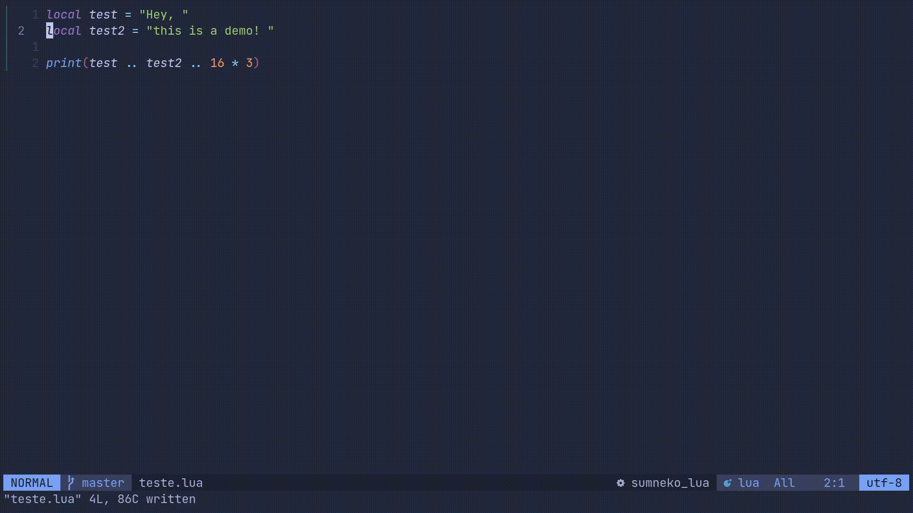

# Eval.nvim
A simple plugin to run your code in a repl and display the results as virtual text inside neovim.



## Requirements
- Neovim >= 0.5

## Installation
Install with your preferred package manager, the following example uses [packer](https://github.com/wbthomason/packer.nvim):

```lua
use {
  "luissimas/eval.nvim",
  config = function()
    require("eval").setup()
  end
  }
```

## Configuration
The plugin can be configured via the `setup` function, here is an example config with all the defaults:
```lua
require("eval").setup({
  prefix_char = "> ", -- char displayed before the output content
  -- a table with each filetype and its respective command to run code
  filetype = {
    lua = {
      cmd = "lua"
    },
    javascript = {
      cmd = "node"
    }
  })
```
The `cmd` option must be an executable in your `PATH` that read from stdin.

## Usage
Eval exposes the command `Eval`, which can be called in normal or visual mode. When called in visual mode, `Eval` will evaluate the current selected text, when called in normal mode the entire buffer will be evaluated.
